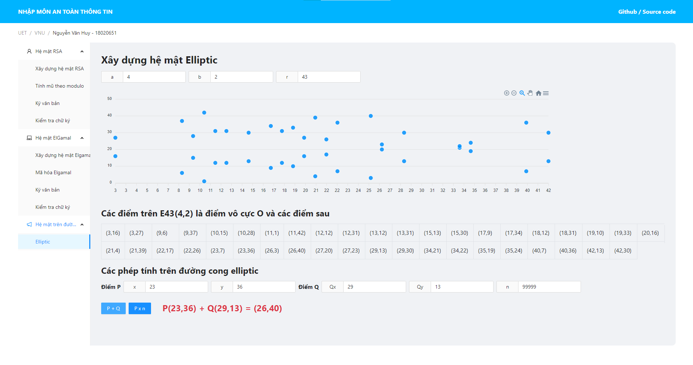
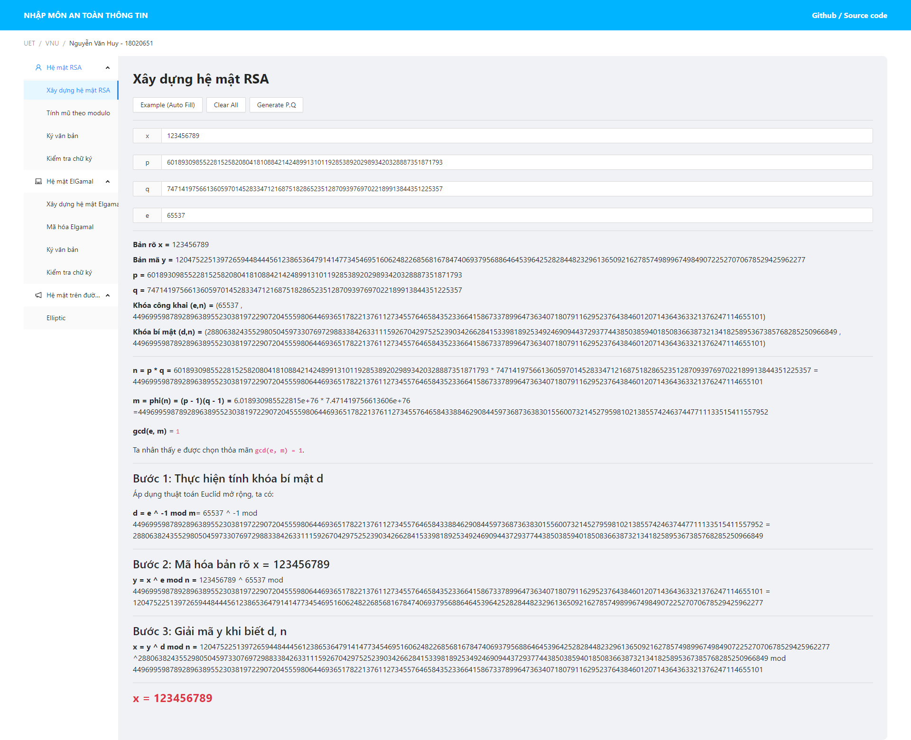
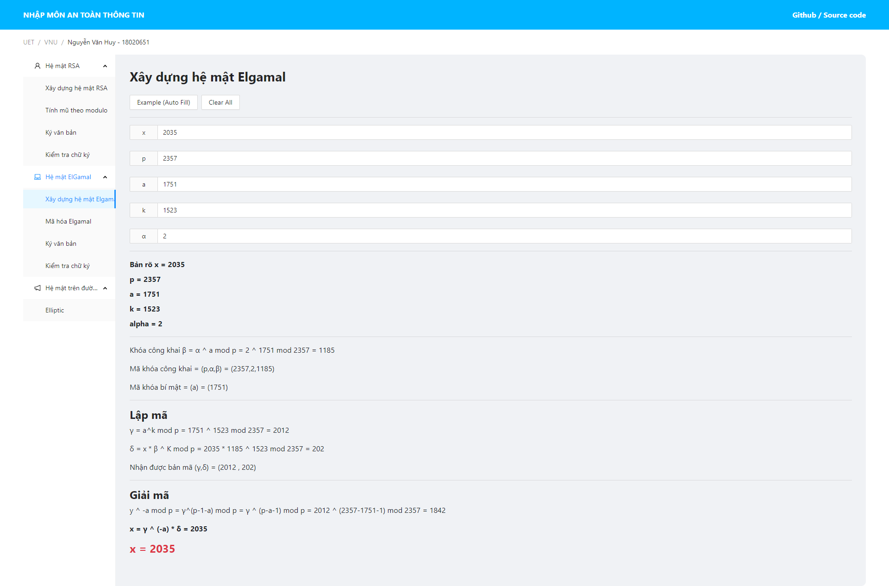

# Nhập môn an toàn thông tin ⚠

## [Deployed here ✅](https://nmattt.noctrlz.tech/)

## Cách cài đặt

- Cài đặt yarn [tại đây](https://yarnpkg.com/)
- Cài đặt các dependency, chạy lệnh
  
  ```
  yarn install
  ```
- Khởi chạy
  ```
  yarn start
  ```
- Truy cập vào đường dẫn http://localhost:3000/
## Demo 

### Hệ mật Elliptic


### Hệ mật RSA
- Xây dựng hệ mật RSA
- Tính mũ theo modulo
- Ký văn bản bằng hệ mật RSA



### Hệ mật Elgamal
- Xây dựng hệ mật Elgamal
- Mã hóa Elgamal
- Ký văn bản
- Kiểm tra chữ ký



